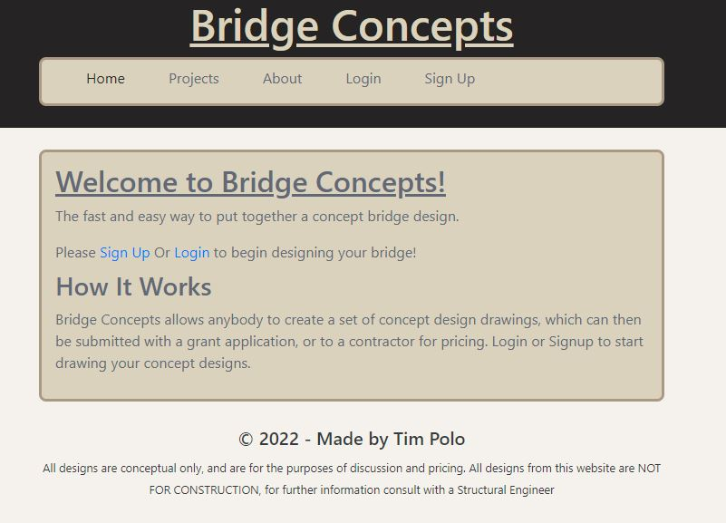

# bridge-concepts

A website that allows users to upload bridge project data, for review by contractors and grant officers

## Site Link

[Live Website](https://desolate-dusk-56870.herokuapp.com/)

## Description

This project allows a user to make bridge projects, and populate those projects with basic data. 

Acceptance Criteria

- Motivation: 
We want to allow Council engineers to easily upload project data for simple bridges. 
- Why did you build this project: 
Currently Council engineers spend a lot of man hours reporting for bridge concept designs
- What problem does it solve: 
It saves Council engineers time, and therefore saves the ratepayer money
- What did you learn: 
Learnt about REACT and the MERN Stack

## Installation

What are the steps required to install your project? 

No steps are required, the website is live and ready to view

## Usage

The website may be accessed via a web browser. 
An example of the site is shown in the image below.

To begin the user accesses the homepage via a web browser
## Credits

- Tim Polo

- USYD & Trilogy

- Google Searches

## License

MIT License

Copyright (c) [2022] [Timothy_Polo]

Permission is hereby granted, free of charge, to any person obtaining a copy
of this software and associated documentation files (the "Software"), to deal
in the Software without restriction, including without limitation the rights
to use, copy, modify, merge, publish, distribute, sublicense, and/or sell
copies of the Software, and to permit persons to whom the Software is
furnished to do so, subject to the following conditions:

CONDITION 1: The client (Horiseon) gives their express permission in writing to alter the code.

The above copyright notice and this permission notice shall be included in all
copies or substantial portions of the Software.

THE SOFTWARE IS PROVIDED "AS IS", WITHOUT WARRANTY OF ANY KIND, EXPRESS OR
IMPLIED, INCLUDING BUT NOT LIMITED TO THE WARRANTIES OF MERCHANTABILITY,
FITNESS FOR A PARTICULAR PURPOSE AND NONINFRINGEMENT. IN NO EVENT SHALL THE
AUTHORS OR COPYRIGHT HOLDERS BE LIABLE FOR ANY CLAIM, DAMAGES OR OTHER
LIABILITY, WHETHER IN AN ACTION OF CONTRACT, TORT OR OTHERWISE, ARISING FROM,
OUT OF OR IN CONNECTION WITH THE SOFTWARE OR THE USE OR OTHER DEALINGS IN THE
SOFTWARE. [https://choosealicense.com/](https://choosealicense.com/).

## How to Contribute

[Contributor Covenant](https://www.contributor-covenant.org/) 

## Tests

None.
